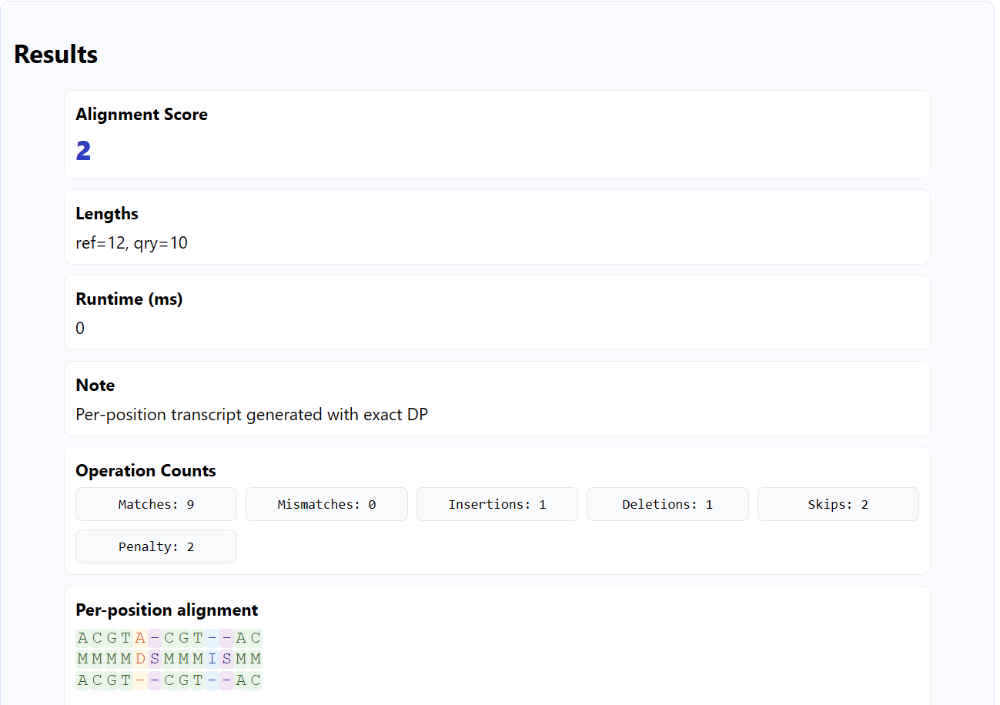
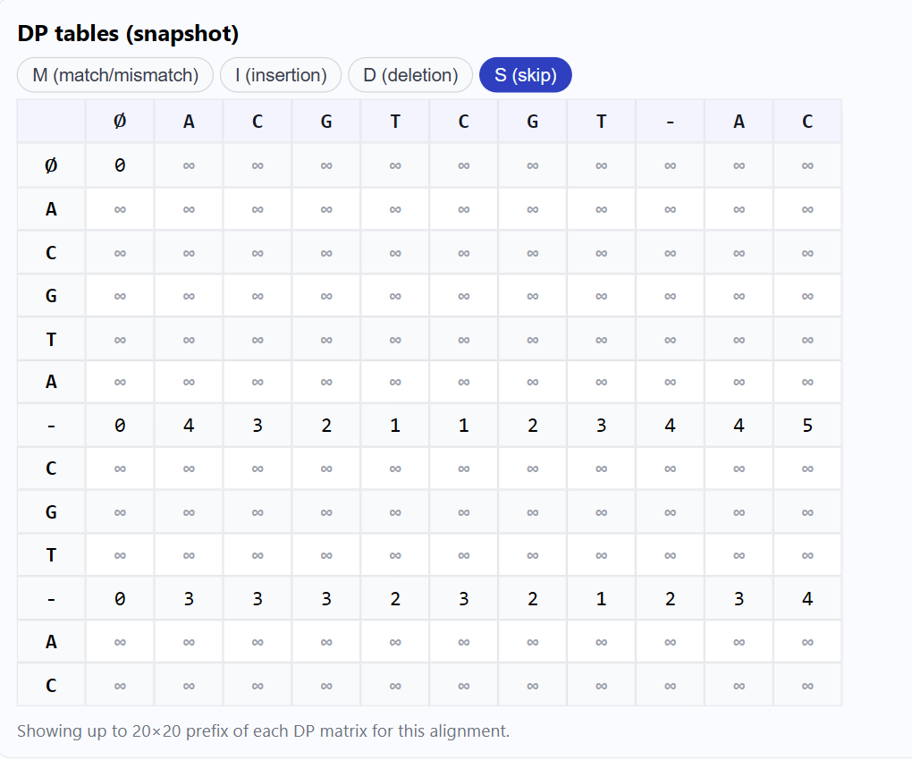
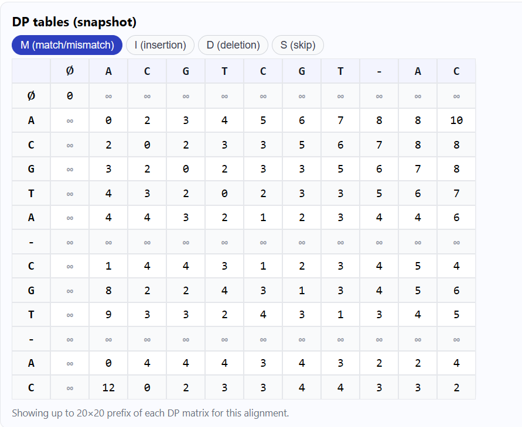
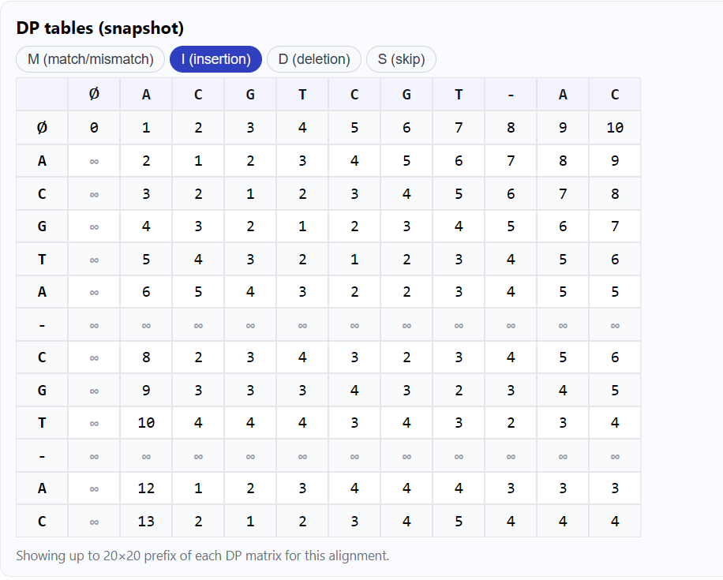
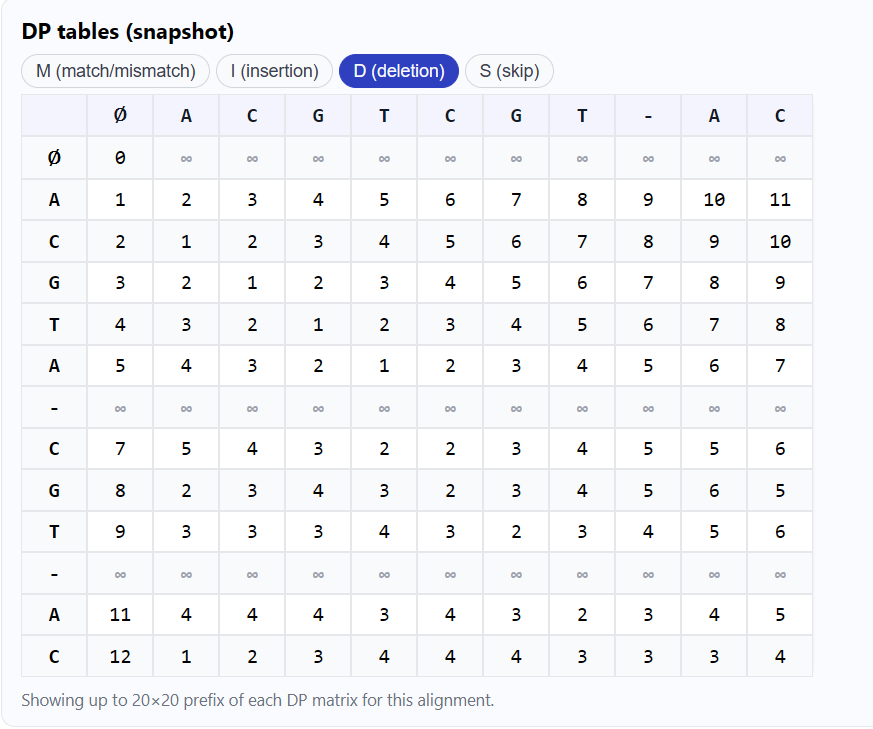

# Skip-Aware Sequence Alignment (M/I/D/S)

This repository contains a web-based application for global sequence alignment that implements an explicit **Skip (S)** operation. It allows for the alignment of raw sequences or `.fna` files while treating pre-existing gaps in a reference sequence as free, non-penalized events. The implementation is based on the four-matrix dynamic programming approach (M, I, D, S) detailed in recent genomics research.

### Why This Approach Matters

Traditional alignment algorithms (like Needleman-Wunsch) lack a built-in mechanism to handle pre-existing gaps in a reference, often found in Multiple Sequence Alignments (MSAs) or pangenome graphs. Penalizing these known gaps can distort alignment scores and lead to biologically incorrect results. The explicit **Skip (S)** event resolves this by allowing the aligner to traverse these gaps at zero cost, leading to more accurate and informative alignments in progressive and comparative genomics contexts.

### Core Algorithm

The alignment engine uses a dynamic programming approach with four distinct states, each stored in its own matrix:

- **M**: The score ending with a **Match** or **Mismatch**.
- **I**: The score ending with an **Insertion** into the reference.
- **D**: The score ending with a **Deletion** from the reference.
- **S**: The score ending with a **Skip** over a gap ('-') in the reference.

The final optimal alignment score is the minimum value found in the last cell across all four matrices: `min{M_m,n, I_m,n, D_m,n, S_m,n}`.

## Features

- **Skip-Aware Logic**: Implements the four-state DP to correctly handle pre-existing gaps at zero cost.
- **Dual DP Modes**:
  - Uses a full, quadratic-memory DP for small inputs to generate exact per-position transcripts and operation counts.
  - Switches to a memory-efficient **linear-space DP** for large inputs to return an optimal score without memory overflow.
- **Streaming FASTA Reader**: Processes large `.fna` files in chunks, ensuring the application's memory footprint remains low. Users can specify a `maxLen` to cap the region size.
- **Interactive UI**: A simple web interface for aligning either pasted text or uploaded files.
- **Per-Position Visualization**: For small inputs, the UI renders a colored "operation track" that shows the specific operation (Match, Mismatch, Insertion, Deletion, or Skip) at each position.

## Software Requirements

- **Node.js**: v18.x or higher
- **npm (Node Package Manager)**: v9.x or higher
- **Express**: v4.x
- **Multer**: v1.4.x
- **cors**: v2.8.x
- **body-parser**: v1.20.x

**Frontend:**

- HTML5
- CSS3 (see included `style.css`)
- Vanilla JavaScript (see included `script.js`)

**Tested on:**

- Ubuntu 22.04, macOS 13 Ventura, Windows 10/11
- Chrome v117+, Firefox v120+, Edge v117+

---

## Installation & Running

1. **Clone the repository:**

   ```
   git clone https://github.com/DollyXSoul/agriculture_genome.git
   cd agriculture_genome
   ```

2. **Install dependencies:**

   ```
   npm install
   ```

3. **Start the web application:**
   ```
   npm run dev
   ```
   By default, this launches the local web server at [http://localhost:3000](http://localhost:3000).

**Note:**

- Make sure you have Node.js (v18.x or higher) and npm (v9.x or higher) installed on your system.
- For best results, use Chrome, Firefox, or Edge on Ubuntu 22.04, macOS 13 Ventura, or Windows 10/11.

2.  **Choose an Input Method**:

    - **Text Input**: Paste your reference and query sequences into the text areas. You can use `-` in the reference to represent known gaps that the aligner will "skip" for free.
    - **File Upload**: Upload a reference and query file in FASTA (`.fa`, `.fasta`, `.fna`) format.

3.  **Configure and Align**:
    - **Max bases per file**: (File mode only) Limits the number of base pairs read from each file to prevent excessive memory usage. Defaults to 300,000.
    - **Band width**: (Optional) Restricts the DP calculation to a diagonal band, speeding up alignment for similar sequences.
    - **Detailed counts / per-position operations**: Check these boxes to compute and display detailed statistics and the visual alignment track. This is only enabled for "small" inputs (≤50,000 bp by default) to ensure performance.

## Output and GUI

| Home                      | Output                     | DP Table(Skip)            |
| ------------------------- | -------------------------- | ------------------------- |
|  |  |  |

| DP Table(Match)            | DP Table(Insertion)            | DP Table(Deletion)          |
| -------------------------- | ------------------------------ | --------------------------- |
|  |  |  |

## Understanding the Scoring

The alignment score represents the total penalty required to transform the query sequence into the reference sequence.

### Default Cost Model:

- **Match**: 0
- **Mismatch**: 1
- **Insertion**: 1
- **Deletion**: 1
- **Skip**: 0 (Free)

With this unit cost model, the score is equivalent to the **total number of penalized edits** (mismatches, insertions, and deletions).

### Interpreting the Score:

- **Score 0**: A perfect match. The sequences are identical, considering that any gaps in the reference were skipped for free.
- **Low Score (e.g., 1-20)**: The sequences are very similar, with only a few differences.
- **High Score (e.g., 100+)**: The sequences are highly divergent.

To compare scores across alignments of different lengths, you can normalize it by calculating the **Percent Identity (PID)**:
`PID ≈ 1 - (score / effective_length)`

## Sample Inputs

- **Test a free skip**:

  - Reference: `ATGCG-TAACGTCGAT`
  - Query: `ATGCGTAACGTCGAT`
  - _Expected Result_: A score of 0, as the `-` is a free skip.

- **Test skips and edits**:
  - Reference: `GGA--TTCG`
  - Query: `GGAATTCGG`
  - _Expected Result_: A non-zero score reflecting the cost of insertions/deletions needed in addition to the two free skips.

## Citing the Method

This work is an implementation of concepts presented in the following research. If you use this tool in your work, please cite the foundational papers on skip-aware alignment.

- N. Mwaniki, N. Pisanti, "Dynamic Programming Alignments With Skips," _IEEE Access_, 2025.

## Team Members

**Team 05**

- Ameesha Patel (252IT003)
- Dolly Chauhan (252IT007)
- Samriddhi Sharma (252IT024)
- Sakshi Vispute (252IT032)

## License

This project is for academic and instructional purposes. It is designed to demonstrate the principles and benefits of skip-aware alignment in a practical, web-based tool.
